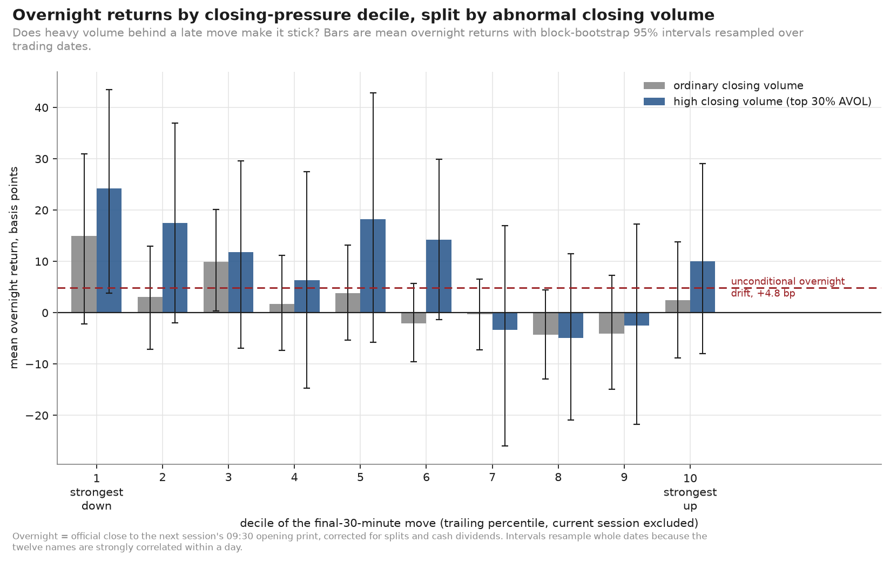

# The closing bell effect

**Does the final half hour of U.S. equity trading carry information into tomorrow?**

A market-microstructure study of 1.2 million 5-minute bars across twelve liquid
U.S. names, 2021–2026, asking whether an unusually strong move in the last thirty
minutes persists or reverses overnight — and whether abnormal closing volume
tells the two apart.

**[Read the report →](report/report.md)**



---

## What we found

**The answer is asymmetric, and the effect is not specific to the close.**

| | Finding |
|---|---|
| **Strong up close** | Overnight return is +7 bp (heavy volume) / +3 bp (ordinary) — indistinguishable from the +4.8 bp an arbitrary session already earns. No persistence, no reversal. |
| **Strong down close** | Overnight return is +29 bp / +18 bp: a partial reversal recovering a quarter to a third of the closing decline. The heavy-volume cell's excess over drift is significant (p = 0.03). |
| **Volume interaction** | Nothing. Every high-minus-ordinary contrast is indistinguishable from zero; the regression interaction is β₃ = −0.006 (t = −0.06). |
| **Is the close special?** | No. The closing window's standardised predictive coefficient (−0.053) is statistically indistinguishable from the midday window's (−0.050). |
| **Stability** | The rolling one-year slope runs from +0.07 to −0.47. Near zero at both ends of the sample. |
| **Economic significance** | R² = 0.005, classifier AUC 0.600 in-sample, 166 bp of dispersion around a 29 bp conditional mean. Descriptive, not a strategy. |

The trading day itself is strongly U-shaped in volume (the closing slot trades
6.7× the midday trough) and only mildly U-shaped in volatility (1.4×). Order flow
concentrates at the close far more than price movement does.

---

## What this study does not claim

OHLCV bars contain prices and share counts. They do **not** contain bid-ask
spreads, quoted depth, order imbalance, or closing-auction imbalance — none of
which is fabricated, estimated, or proxied anywhere in this repository. Candidate
mechanisms (liquidity provision, index rebalancing, informed trading) are
discussed in the report as hypotheses this dataset **cannot** adjudicate.

The study is free of look-ahead bias, which is tested directly. That is a weaker
claim than out-of-sample validity: coefficients are estimated in-sample and there
is no hold-out period.

---

## Quick start

```bash
make venv          # virtualenv + package
make external      # daily bars, splits, dividends, VIX      (~1 min)
make data          # download and ingest 5-minute bars       (~25 min, ~20 GB transferred)
make pipeline      # full analysis -> results/               (~6 min)
make figures       # rebuild every figure from saved tables
make test          # 67 tests
```

Raw monthly files are deleted as they are consumed; peak disk use is roughly one
400 MB file per worker. `data/` is gitignored — this repository ships code and
results, not redistributed vendor data.

---

## The data

Genuine 1-minute consolidated U.S. equity bars from the Hugging Face dataset
[`mito0o852/OHLCV-1m`](https://huggingface.co/datasets/mito0o852/OHLCV-1m),
aggregated to 5-minute regular-hours bars in `America/New_York` using the XNYS
exchange calendar.

| | |
|---|---|
| Universe | SPY, QQQ, IWM, AAPL, MSFT, NVDA, AMZN, META, GOOGL, JPM, XOM, TSLA |
| Period | 2021-01-04 → 2026-03-31 (1,316 sessions, 10 early closes) |
| Bars | 1,220,267 regular-hours 5-minute bars |
| Completeness | 99.4% of expected bars; 98.9% of ticker-sessions usable |
| Closing auction | captured on 96.6% of ticker-sessions |

**Validated against an independent daily vendor**: median absolute close error
0.0–1.0 bp per ticker, and regular-hours + auction volume reconciling to 86–95%
of vendor daily volume — the remainder being the extended-hours trading the panel
excludes by construction.

Three genuine data defects were found and are handled by automated checks that
remain in the pipeline: symbol reuse (`META` belonged to a different issuer
before Facebook's rename), erroneous prints (the 2023-01-24 NYSE opening-auction
error), and missing closing auctions (XOM for much of 2021–2024). Full account in
**[docs/data_sources.md](docs/data_sources.md)**.

---

## Method in brief

- **Events** are the top/bottom 5% of each ticker's *own trailing 60-session*
  distribution of final-30-minute returns — never a pooled threshold, never a
  full-sample quantile. 1% tails as robustness.
- **Abnormal volume** is `AVOL = log(V_close) − log(trailing median V_close)`
  over 15:30–16:00 including the auction.
- **Inference** uses a block bootstrap that resamples whole trading dates, and
  two-way clustered standard errors, because twelve correlated names share every
  date. Date-only, ticker-only and HC1 alternatives are reported side by side.
- **Every conditional mean is reported against the unconditional overnight
  drift**, and every persistence rate against a drift-implied benchmark rather
  than 50%.
- **No look-ahead**: all normalisation excludes the current session. Verified by
  running the pipeline on the full and truncated samples and requiring identical
  classifications on the overlap.

---

## Repository

```
src/closingbell/
  config.py           universe, paths, session and estimation constants
  calendar_utils.py   XNYS sessions, early closes, DST, next-session mapping
  ingest.py           download -> filter -> 1-minute to 5-minute aggregation
  external.py         daily bars, splits, dividends, VIX
  validation.py       cross-validation against the independent vendor
  sessions.py         session quality control and exclusion accounting
  seasonality.py      intraday profile and U-shape diagnostics
  features.py         prices, window returns, overnight, corporate actions
  normalize.py        trailing z-scores, percentiles, AVOL   (leak-free core)
  events.py           2x2 experiment, date-block bootstrap, deciles
  regressions.py      panel regression, persistence logit, rolling estimates
  timeofday.py        morning / midday / close placebo comparison
  regimes.py          VIX, market direction, calendar regimes
  plots.py            all ten figures
  pipeline.py         end-to-end orchestration
  figures.py          figure entry point

notebooks/            01 audit · 02 intraday · 03 core · 04 regressions · 05 robustness
docs/                 research_plan · data_sources · data_leakage_audit
report/report.md      the write-up
results/tables/       40 CSVs · results/figures/ 10 PNGs · results/summary.json
tests/                67 tests
```

## Figures

| | |
|---|---|
| `fig01` volume U-curve | `fig06` **hero** — overnight by decile × volume regime |
| `fig02` volatility U-curve | `fig07` persistence vs the drift-implied benchmark |
| `fig03` closing-pressure distribution | `fig08` rolling close→overnight relationship |
| `fig04` close₃₀ vs overnight scatter | `fig09` morning / midday / close comparison |
| `fig05` overnight by decile | `fig10` per-ticker coefficient forest plot |

## Tests

67 tests covering timezone localisation and DST transitions, early closes,
holiday handling, 1-minute→5-minute aggregation, closing-window and auction
aggregation, overnight arithmetic with split and dividend corrections,
next-session matching across holidays and data gaps, trailing normalisation,
end-to-end absence of look-ahead, block-bootstrap inference, and session quality
control.

```bash
make test
```

## Documentation

- **[report/report.md](report/report.md)** — the findings, in full
- **[docs/research_plan.md](docs/research_plan.md)** — design and pre-specified interpretation rules
- **[docs/data_sources.md](docs/data_sources.md)** — provenance, validation, and the three defects found
- **[docs/data_leakage_audit.md](docs/data_leakage_audit.md)** — every leakage channel, and the test that guards it
