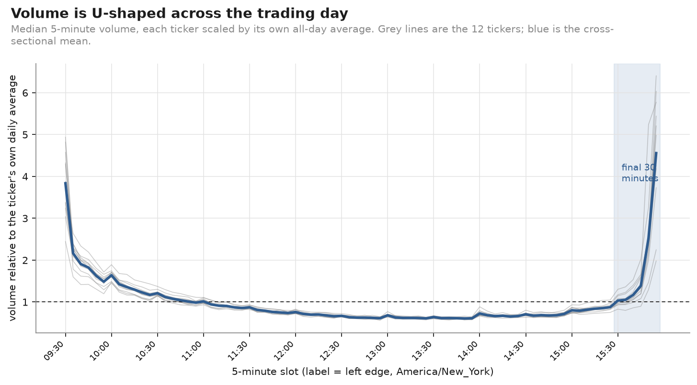
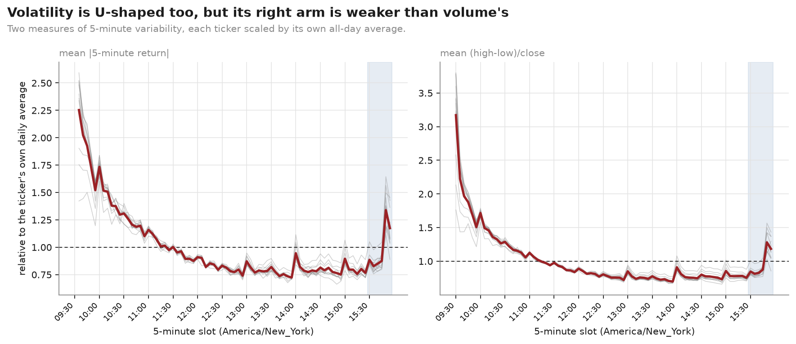
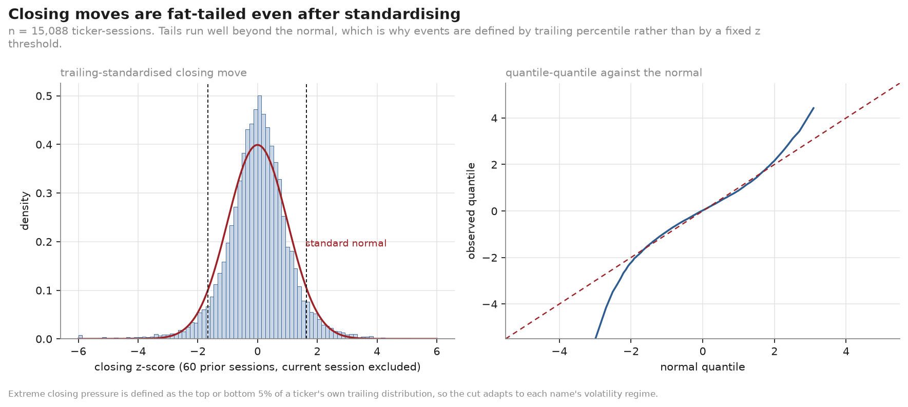
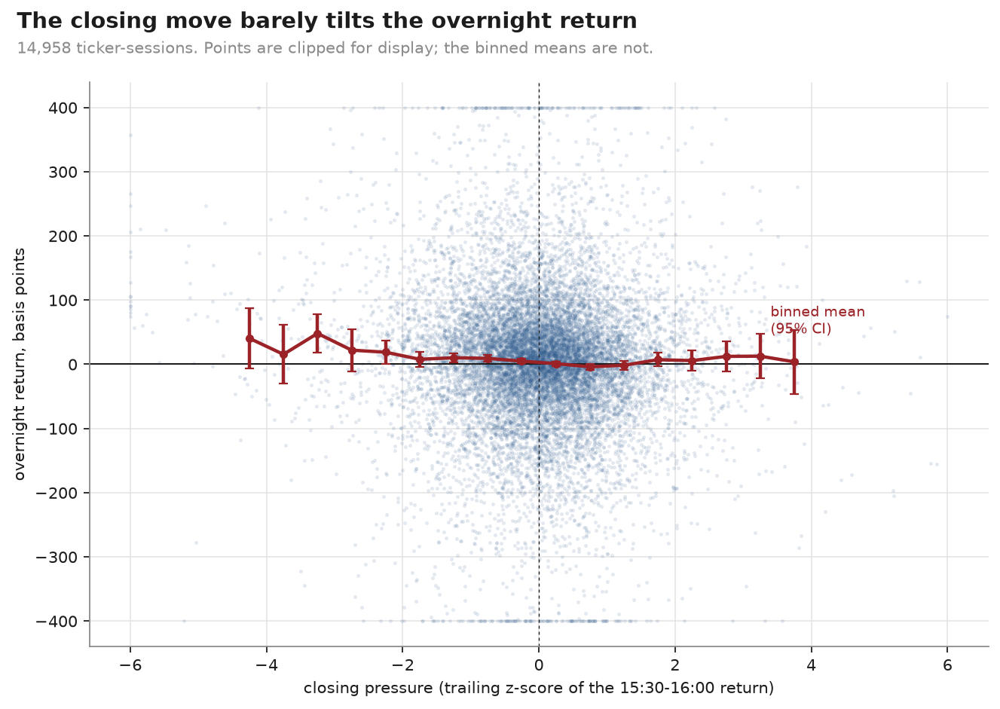
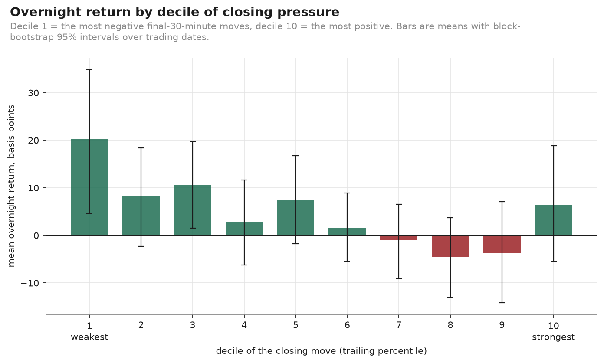
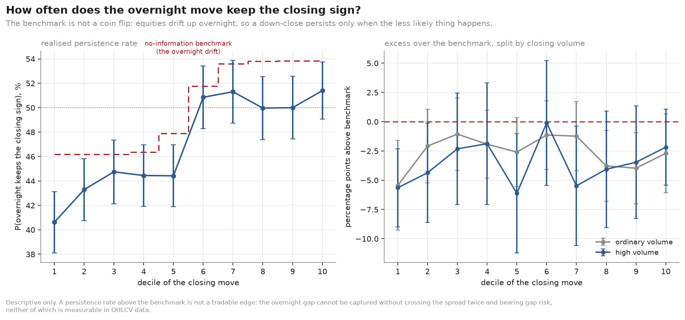
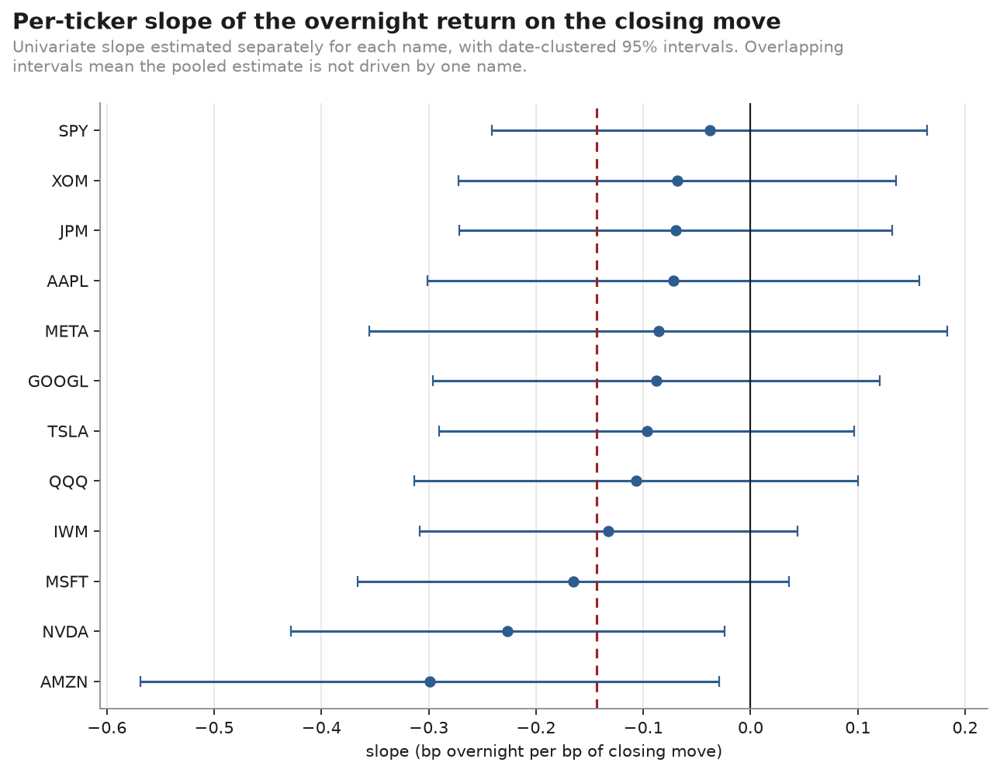
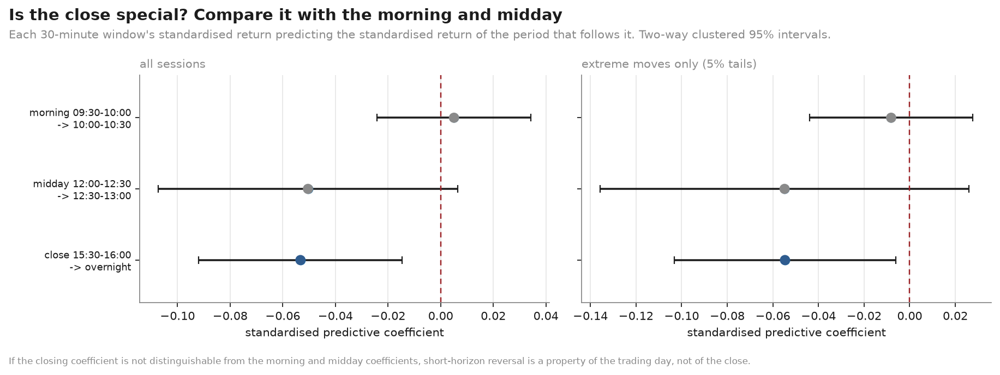
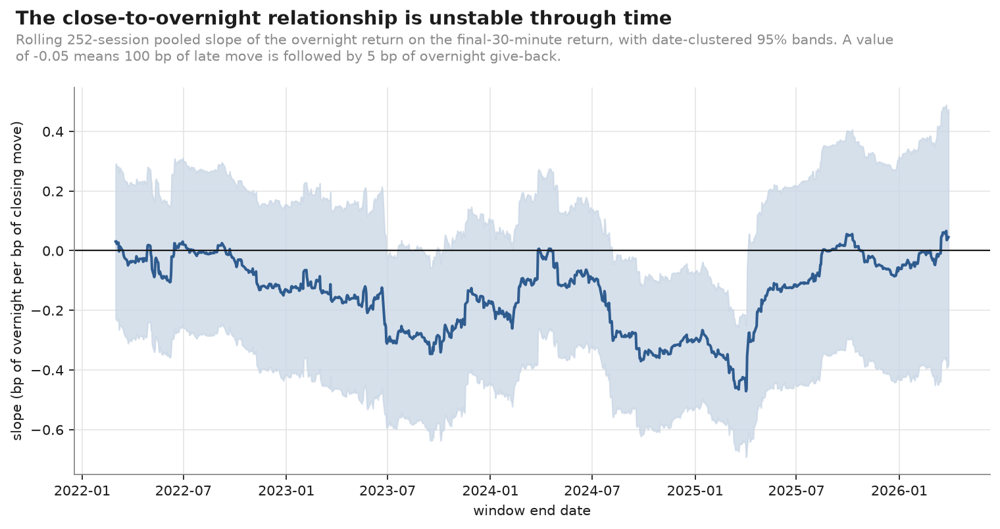

# The closing bell effect

### Does the final half hour carry information into tomorrow?

**Sample.** SPY, QQQ, IWM, AAPL, MSFT, NVDA, AMZN, META, GOOGL, JPM, XOM, TSLA ·
5-minute bars · 2021-01-04 to 2026-03-31 · 1,316 exchange sessions ·
1,220,267 regular-hours bars · `America/New_York`.

---

## Summary of findings

1. **The trading day is strongly U-shaped in volume and only mildly U-shaped in
   volatility.** The final 5-minute slot carries 4.6× the average slot's volume
   — 6.7× the midday trough — but only 1.4× the midday price movement. The close
   is where trading concentrates, not where prices move most per share traded.

2. **The answer is asymmetric.** After an unusually strong *upward* final half
   hour, the overnight return is +7 bp with heavy closing volume and +3 bp
   without — statistically indistinguishable from the +4.8 bp that a randomly
   chosen session already earns. After an unusually strong *downward* final half
   hour, the overnight return is +29 bp and +18 bp: a partial reversal that
   recovers roughly a quarter to a third of the closing decline.

3. **Abnormal closing volume does not separate persistence from reversal.**
   Every high-minus-ordinary contrast is indistinguishable from zero
   (p = 0.40 and 0.69 overnight), and the regression interaction term is
   essentially zero (β₃ = −0.006, t = −0.06). The point estimates lean toward
   heavier volume meaning *more* reversal after down closes, which is the
   opposite of the "conviction" reading, but the data cannot support that
   direction either.

4. **The close does not pass its own placebo test.** The standardised predictive
   coefficient at the close (−0.053) is statistically indistinguishable from the
   midday window's (−0.050). What looks like a closing effect is better described
   as short-horizon reversal that exists elsewhere in the day too.

5. **The relationship is unstable through time.** The rolling one-year slope runs
   from +0.07 to −0.47, with the reversal concentrated in 2023–2025 and close to
   zero at both ends of the sample.

**The one-sentence answer.** A strong late move does not reliably persist
overnight; strong *declines* partially reverse while strong *advances* do
nothing beyond the ordinary overnight drift; closing volume does not tell the
two apart; and the effect is not specific to the close.

---

## 1. The shape of the trading day

Before asking whether the last half hour is informative, it is worth establishing
what the last half hour normally *is*. Both curves below are measured, not
assumed: each ticker is scaled by its own all-day average, so the level
differences between an ETF and a single name drop out and the shape remains.

The U is unmistakable and steep. Averaged across the twelve names, the opening
5-minute slot trades 3.8× the day's average slot, the midday trough at
12:30–13:30 trades 0.69×, and the final slot trades 4.6×. The close/midday ratio
is 6.7×; the open/midday ratio is 5.6×. **The right arm of the volume U is
higher than the left** — more trading happens in the last five minutes of the
day than the first.

Volatility is U-shaped too, but far less dramatically, and asymmetrically so. The
opening slot's high-low range is 3.2× the daily average and the closing slot's is
only 1.2×; mean absolute return at the close is 1.39× the midday level against an
opening ratio several times larger. The 15:30–16:00 window as a whole is roughly
*average* in volatility (0.97–0.99× the day) while carrying about a fifth of the
day's volume.

That gap is the single most useful piece of context in this report. **Order flow
concentrates at the close far more than price movement does.** A great deal is
traded in the last half hour without prices moving proportionately — consistent
with the closing auction absorbing large, largely uninformative rebalancing
demand. It is also the reason a "big" closing move has to be defined relative to
each ticker's own recent closing moves rather than against the rest of the day.

### How much activity is the close?

The 15:30–16:00 window, including the closing auction, is a median **21%** of
regular-hours volume (range 11% for TSLA to 31% for JPM), of which the auction
alone is a median 7%. Roughly one share in five trades in the final thirty
minutes of a six-and-a-half hour session.

### Closing moves are fat-tailed

After standardising each ticker's final-30-minute return against its own trailing
60 sessions, the distribution is still markedly heavier-tailed than a normal.
This is why events are defined by trailing *percentile* rather than by a fixed
z threshold: a ±2σ cut would select wildly different numbers of events across
tickers and across time.

---

## 2. Does the closing move carry into the night?

### The raw relationship

The cloud is close to structureless. The binned means tilt gently downward — more
positive closing pressure, slightly lower overnight return — but the tilt is
small relative to the dispersion. The standard deviation of the overnight return
(138 bp) is more than three times that of the closing move (41 bp), so even a
real conditional effect is a thin signal inside a wide distribution.

### The decile picture, and the benchmark that matters

The pattern is a downward drift across deciles, not a symmetric reversal: the
bottom deciles are clearly positive and the top deciles hover near or just below
zero. Read naively that says "down closes bounce, up closes do nothing", which is
right — but only once the benchmark is set correctly.

**Equities drift up overnight.** Across all 14,958 eligible sessions the mean
overnight return is **+4.8 bp** and 54% of overnight returns are positive. A cell
mean of +7 bp is therefore not evidence of persistence after an up close; it is
what an arbitrary session already delivers. Every conditional mean below is
reported against that benchmark.

### The central experiment

Extreme closing pressure is the top or bottom 5% of each ticker's own trailing
distribution — 1,974 events, mean absolute closing move 77 bp. Splitting by
whether closing volume was in the top 30% of its own trailing distribution gives
the study's central table.

| Direction | Closing volume | n | Mean close₃₀ | Mean overnight | 95% CI | **Excess over drift** | 95% CI | p | P(same sign) |
|---|---|---:|---:|---:|---|---:|---|---:|---:|
| *baseline (all eligible)* | — | 14,958 | −0.2 bp | **+4.8 bp** | [−0.2, +9.9] | — | — | — | — |
| strong up | high | 625 | +83.8 bp | +7.2 bp | [−12.1, +28.2] | **+2.4 bp** | [−17.0, +22.1] | 0.81 | 0.53 |
| strong up | ordinary | 391 | +58.8 bp | +2.9 bp | [−12.9, +19.0] | **−1.9 bp** | [−17.6, +13.6] | 0.79 | 0.53 |
| strong down | high | 611 | −85.5 bp | +29.3 bp | [+4.4, +51.6] | **+24.5 bp** | [+2.8, +45.5] | **0.03** | 0.39 |
| strong down | ordinary | 347 | −69.6 bp | +18.0 bp | [−3.3, +38.3] | **+13.2 bp** | [−7.3, +33.0] | 0.21 | 0.39 |

*Intervals are block-bootstrap over trading dates. Full table with medians,
clustered t-statistics and three further horizons:
`results/tables/central_2x2.csv`.*

Three things fall out of this table.

**Strong up closes are uninformative.** Both up cells sit within 3 bp of the
unconditional drift, with intervals comfortably spanning zero. An 84 bp surge
into the close tells you nothing about the overnight return that a coin toss
would not.

**Strong down closes partially reverse.** The down cells recover +18 to +29 bp
overnight against closing declines of −70 to −86 bp — roughly a quarter to a
third of the move handed back before the next session even begins. The
high-volume cell's excess over drift is distinguishable from zero (+24.5 bp,
p = 0.03); the ordinary-volume cell's is not (+13.2 bp, p = 0.21).

**The asymmetry is the finding.** Persistence and reversal are not two sides of
one coefficient here. Late selling gets partly retraced; late buying does not
extend.

### Persistence as a probability

The naive statement of "persistence" — does the overnight return carry the same
sign as the closing move — is contaminated by the same drift. Since 54% of
overnight returns are positive, an up close persists 54% of the time under the
null and a down close persists only 46% of the time. The left panel draws that
drift-implied benchmark; the right panel plots the excess over it.

**Realised persistence is below the benchmark in every single decile.** Not just
in the tails: across the whole distribution of closing moves, the overnight
return keeps the closing sign 2 to 6 percentage points less often than the drift
alone would produce. Whatever is happening is a broad, mild reversal tendency
rather than something that switches on at the extremes.

A logit on the extreme events, with absolute closing pressure, direction, AVOL,
their interaction and controls, confirms how weak this is. Only `direction` is
significant (β = 0.30, p = 0.001) — and that coefficient is simply the drift
again. Absolute pressure (p = 0.90), AVOL (p = 0.41) and their interaction
(p = 0.35) are all indistinguishable from zero. The model's in-sample AUC is
**0.600** and its Brier score 0.2411 against a base-rate benchmark of 0.2487: a
0.8% improvement on always predicting the base rate. Predicted probabilities span
only 0.32 to 0.61, and calibration is reasonable within that narrow band.

**This is descriptive, not a strategy.** A classifier that barely beats the base
rate, on returns that cannot be captured without crossing the spread twice and
holding overnight gap risk, is a description of a conditional distribution.

---

## 3. Does closing volume distinguish persistence from reversal?

This was the sharpest part of the question, and the answer is no.

| Direction | Outcome | High-vol mean | Ordinary mean | Difference | 95% CI | p |
|---|---|---:|---:|---:|---|---:|
| strong up | overnight | +7.2 bp | +2.9 bp | +4.4 bp | [−17.7, +27.4] | 0.69 |
| strong down | overnight | +29.3 bp | +18.0 bp | +11.3 bp | [−16.4, +38.6] | 0.40 |
| strong up | next open 30 min | −7.8 bp | +4.6 bp | −12.4 bp | [−26.1, +1.1] | 0.07 |
| strong down | next open 30 min | +5.3 bp | +3.7 bp | +1.7 bp | [−14.0, +18.0] | 0.85 |
| strong down | next close-to-close | +39.4 bp | +6.4 bp | +33.0 bp | [−3.1, +69.3] | 0.08 |

Not one contrast clears conventional significance. The regression tells the same
story from the other direction: the interaction term β₃ = −0.006 with
t = −0.06 (two-way clustered) — as close to a precise zero as this data produces.

The point estimates do lean consistently one way: heavier closing volume goes
with *more* reversal after down closes, not less. If anything survived
replication it would argue that heavy late selling is liquidity demand that gets
paid back, rather than informed flow that continues. But with p = 0.47 that
reading is not supported, and it is stated here only to be explicit about the
direction the noise points.

Two near-significant results deserve a flag rather than a headline: after a
strong *up* close, heavy volume is followed by −12.4 bp over the next morning's
first thirty minutes relative to ordinary volume (p = 0.07), and after a strong
*down* close the high-minus-ordinary gap over the next close-to-close is +33.0 bp
(p = 0.08). Among sixteen contrasts examined, two near 0.07 is what chance
produces.

---

## 4. The regression

$$R^{overnight}_{i,t+1} = \alpha_i + \beta_1 R^{close}_{i,t} + \beta_2 AVOL_{i,t} + \beta_3 R^{close}_{i,t}AVOL_{i,t} + \gamma X_{i,t} + \epsilon$$

Estimated on all 14,945 eligible ticker-sessions (not only extremes), in basis
points, with ticker fixed effects and two-way clustering by ticker and date.

| Term | Coefficient | SE | t | p |
|---|---:|---:|---:|---:|
| `r_close30` | **−0.144** | 0.064 | **−2.23** | 0.026 |
| `avol` | +9.60 | 5.99 | 1.60 | 0.109 |
| `r_close30 × avol` | −0.006 | 0.096 | −0.06 | 0.949 |
| market session return | +0.026 | 0.049 | 0.54 | 0.586 |
| realised volatility | −223.6 | 854.0 | −0.26 | 0.794 |
| previous overnight | −0.002 | 0.020 | −0.07 | 0.941 |
| month end | +5.91 | 10.54 | 0.56 | 0.575 |

β₁ = −0.144 says that 100 bp of closing move is followed by about 14 bp of
overnight give-back. The R² is 0.005 — this is a weak conditional tilt on a very
noisy variable, not a description of what overnight returns do.

**The estimate is stable across specifications** (−0.132 to −0.147 as ticker
fixed effects, market and volatility controls, the previous overnight return and
calendar dummies are added in turn) and **across error structures**: t = −2.23
two-way clustered, −1.99 date-clustered, −3.57 heteroskedasticity-robust. Ticker
clustering alone gives t = −6.00, which is exactly why it is not the headline
number — with twelve names and 1,300 dates, the cross-sectional correlation
within a date is the dependence that matters.

**It is not an artefact of the shared closing price.** `r_close30` ends at
`P(16:00)` and `r_overnight` begins there, so any measurement error in the
closing price enters the two with opposite signs and manufactures negative
correlation. Re-measuring the closing move to the last regular-hours trade —
so predictor and outcome share no price at all — gives β₁ = −0.138 (t = −2.13).
The mechanical channel is not what is driving this.

All twelve coefficients are negative, ranging from −0.30 (AMZN) to −0.04 (SPY),
and only AMZN and NVDA are individually distinguishable from zero. The pooled
estimate is not the product of one name.

---

## 5. Is the close actually special?

This is the test the effect has to pass before "closing bell effect" is the right
name for it. Three 30-minute windows, each standardised within its own slot, each
tested against the period that immediately follows it.

| Window | Predicts | Standardised β | 95% CI | t | n |
|---|---|---:|---|---:|---:|
| 09:30–10:00 | 10:00–10:30 | +0.005 | [−0.024, +0.034] | 0.34 | 15,144 |
| 12:00–12:30 | 12:30–13:00 | −0.050 | [−0.107, +0.007] | −1.74 | 15,136 |
| **15:30–16:00** | **overnight** | **−0.053** | [−0.092, −0.015] | −2.75 | 14,999 |

The closing coefficient is the only one that clears significance on its own — and
it is **statistically indistinguishable from the midday coefficient**, whose
point estimate is −0.050 against the close's −0.053. The confidence intervals
overlap almost entirely. The close's advantage in t-statistic comes from a
tighter standard error, not a larger effect.

The morning is the genuine outlier: the first half hour predicts essentially
nothing about the next half hour.

**This is the most important qualification in the report.** A reversal tendency
of the same magnitude sits in the middle of the day, where there is no auction,
no index rebalancing, no end-of-day mark, and no overnight risk. Calling the
closing result a "closing bell effect" attributes to the close something the
midday session does just as much of.

---

## 6. Stability and regimes

The rolling 252-session slope wanders from **+0.07 to −0.47**. It is near zero
through 2021 and into 2022, strongly negative from mid-2023 through early 2025,
and back near zero by the end of the sample. For most of the window the
confidence band includes zero. A full-sample point estimate of −0.144 is an
average over regimes that look genuinely different, and the most recent year
looks like the quiet ones.

Conditioning the extreme-event results on market state
(`results/tables/regime_tables.csv`, exploratory):

- **Reversal after down closes survives both VIX regimes** and is if anything
  larger in calm markets (+32.8 bp low VIX vs +20.7 bp high VIX).
- **It is largest when the market itself rose** on the day (+62.9 bp, n = 104):
  a name selling off into the close of an up day retraces most.
- **Month-end** amplifies it (+42.6 bp vs +23.3 bp), consistent with rebalancing
  pressure, though month-end also has only 98 down events.
- Day-of-week differences (Tuesday +57.1 bp, Friday −13.1 bp) are almost
  certainly noise: with seven regime variables × two directions, several
  individually significant cells are expected under the null.

Option expiration shows nothing distinguishable (n = 37 down events). No FOMC
analysis is reported — see [data_sources.md](../docs/data_sources.md#what-is-deliberately-absent).

---

## 7. Robustness

| Check | Result |
|---|---|
| 1% tails instead of 5% (508 events) | Same qualitative picture, wider intervals; no cell's excess over drift is significant |
| 60-minute closing window | β₁ = −0.154 (t = −2.76), same sign, slightly stronger |
| Excluding split and ex-dividend sessions | β₁ = −0.139 (t = −2.17), essentially unchanged |
| Predictor and outcome sharing no price | β₁ = −0.138 (t = −2.13) |
| Restricting to extreme events only | β₁ = −0.091 (t = −0.93), not distinguishable from zero |
| Other outcomes (next open 30 min, next session, next close-to-close) | `results/tables/regression_other_outcomes.csv` |
| Error structures (two-way / date / ticker / HC1) | t between −1.99 and −6.00, all negative |

---

## 8. Why this dataset cannot identify the mechanism

The results describe a conditional distribution. They do not explain it, and with
OHLCV bars they cannot.

**What the data contains:** open, high, low, close and share volume in 5-minute
buckets, plus the closing auction print and its size.

**What the data does not contain, at all:**

- **Bid-ask spreads.** Nothing here measures the cost of transacting, which is
  what determines whether a 29 bp conditional mean is accessible or fictional.
- **Quoted depth.** Whether a late move happened against a thin or thick book is
  invisible; both look identical in an OHLCV bar.
- **Order imbalance.** Volume is a count of shares traded. Every trade has a
  buyer and a seller, and nothing in this dataset says which side initiated. A
  bar of 5 million shares says nothing about whether buyers or sellers were the
  aggressors.
- **Auction imbalance.** The imbalance feeds published from 15:50 — the actual
  information late-session participants trade on — are not in this dataset. We
  observe the auction's size and price, never the imbalance that produced them.

Several mechanisms are consistent with what we found and **cannot be
distinguished with this data**:

- *Liquidity provision.* Late sellers demand immediacy, market makers and
  overnight liquidity providers absorb it and are compensated by the partial
  reversal. Testing this needs spreads and depth.
- *Index and fund rebalancing.* Mechanical, uninformed closing-auction demand
  that pushes price away from value and lets it return. Testing this needs
  imbalance data and index-event calendars.
- *Informed trading.* Late buyers acting on information, which would show as
  persistence — this we can say we did *not* observe on the up side, but we
  cannot say why not.
- *Asymmetric attention or funding effects* producing the up/down asymmetry.

The asymmetry we document is the sort of fact that would let someone with quote
and imbalance data discriminate between these. It is not itself evidence for any
of them, and this report makes no claim about which is operating.

---

## 9. Statistical versus economic significance

The distinction matters more here than the p-values do.

**Statistically**, the headline coefficient survives clustering, control sets,
window definitions and the shared-price concern. **Economically** it is small and
almost certainly inaccessible:

- The largest conditional mean in the study is **+29 bp overnight after a heavy
  down close**, on 611 events out of 14,958 sessions — about 4% of the sample.
- The standard deviation of the overnight return within those events is
  **166 bp**, roughly six times the mean. Even if the mean is real, individual
  outcomes are dominated by noise.
- Capturing it would require buying at the closing auction and selling at the
  next open: crossing the spread twice, on names whose spreads this dataset does
  not measure, while carrying unhedged overnight gap risk.
- The regression R² is **0.005**.
- The classifier's AUC is **0.600** in-sample, with no hold-out period.
- The relationship was near zero for two of the five years studied.

A conditional mean that is statistically distinguishable from zero at p = 0.03,
worth 29 bp, on 4% of sessions, with 166 bp of dispersion around it, and unstable
across regimes, is a description of how prices behave. It is not an edge, and
nothing here was designed to test whether it could be one.

---

## 10. Limitations

**Sample.** Twelve mega-cap names over five years and one quarter. Findings may
not extend to small caps, less liquid names, or other periods. The window
contains an unusual macro sequence — the 2022 bear market, the 2023–24 rally,
the April 2025 tariff shock — and the rolling estimates show the effect is not
constant across them.

**Cross-sectional dependence.** Twelve highly correlated names is effectively
far fewer than twelve independent series. Date-blocked bootstraps and two-way
clustering address this, but the effective sample is closer to 1,316 dates than
to 14,958 observations.

**Multiple comparisons.** Four outcome horizons, two tail definitions, seven
regime variables, and a specification ladder. The regime results in particular
should be read as exploratory.

**In-sample estimation.** No hold-out period, no walk-forward validation. The
study is free of look-ahead bias (see
[data_leakage_audit.md](../docs/data_leakage_audit.md)) but that is a weaker
claim than out-of-sample validity.

**Data quality.** 0.6% of expected bars are missing and 166 of 15,792
ticker-sessions were excluded by quality filters. Three real defects were found
and handled — symbol reuse, erroneous prints, missing auctions — each documented
in [data_sources.md](../docs/data_sources.md). Closing auctions are captured on
96.6% of ticker-sessions; the rest fall back to the last regular-hours trade.

**Threshold choices.** The 5% tail, the 30% AVOL cut, the 60-session window and
the quality thresholds are reasonable but not uniquely determined. The 1% tail
robustness check is provided; a systematic sensitivity analysis over all four is
not.

**No mechanism.** Section 8 stands: with OHLCV alone the mechanism question is
out of reach, and none of the candidate explanations is tested here.

---

## Appendix: where the numbers live

| Result | File |
|---|---|
| Session QC and exclusions | `results/tables/session_quality_summary.csv`, `session_exclusions.csv` |
| Independent-vendor cross-validation | `results/tables/data_crossvalidation.csv` |
| Intraday profile and U-shape diagnostics | `results/tables/intraday_profile.csv`, `u_shape_diagnostics.csv` |
| Central 2×2, all horizons | `results/tables/central_2x2.csv` |
| Volume contrasts | `results/tables/volume_contrast_all.csv` |
| Main regression and robustness | `results/tables/regression_*.csv` |
| Persistence logit and calibration | `results/tables/persistence_*.csv` |
| Time-of-day comparison | `results/tables/time_of_day_*.csv` |
| Regime tables | `results/tables/regime_tables.csv` |
| Machine-readable summary | `results/summary.json` |
